# Dashy

Build a dashboard inside an Obsidian note from six markdown blocks. The config is YAML,
a few lines of it. **No JavaScript, and no Dataview.** The same blocks turn the checkboxes
in your daily notes into [a habit tracker](#a-habit-tracker-from-daily-note-checkboxes).

<picture>
  <source media="(prefers-color-scheme: dark)" srcset="docs/screens/dashboard-dark.png">
  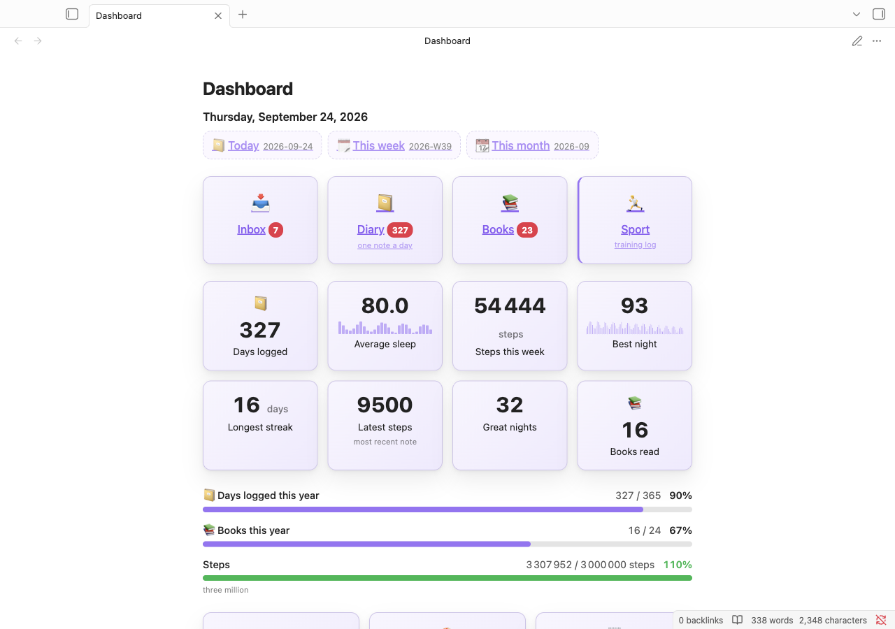
</picture>

Everything above is one note. Here is the whole of the first block in it:

````markdown
```today
daily: true
weekly: true
monthly: true
```
````

## A habit tracker from daily note checkboxes

Tick a box in a daily note's Properties, say `gym: true`, and the note already feeds a habit
tracker. Every block that reads a `field` counts a ticked day as 1 and an unticked one as 0.

````markdown
```stats
columns: 3
items:
  - { label: Gym days, source: Diary, field: gym, agg: sum }
  - { label: Longest streak, source: Diary, field: gym, agg: streak, unit: days }
  - { label: Gym this week, source: Diary, field: gym, agg: sum, period: week, compare: true, better: up }
```

```heatmap
source: Diary
field: gym
```
````

<picture>
  <source media="(prefers-color-scheme: dark)" srcset="docs/screens/habits-dark.png">
  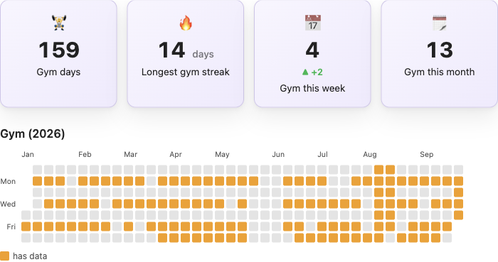
</picture>

`sum` counts the days you went. `streak` finds your longest run, and an unticked day breaks
it the way a missing note does. `period: week` narrows a card to the current week, starting
on Monday or Sunday as your language has it, and `compare: true` sets it against the same
days of last week, green when you went more often. The heatmap paints the ticked days.

You write this once. `period` counts from today, so "this week" is always this week and a
`period: year` card starts over on 1 January without an edit.

## How it differs from a query plugin

Dashy reads your notes' frontmatter through Obsidian's own metadata cache. Four
consequences of that, worth knowing before you install anything:

- **One plugin, not two.** Nothing to install alongside it, nothing to explain to someone
  you share a vault with.
- **No code in your notes.** A `dataviewjs` block is a program. These are eight lines of
  YAML that you, a month from now, can read at a glance.
- **It follows your theme.** Not one colour is hard-coded. Every surface mixes from the
  variables your theme and accent colour define.
- **It tells you when the config is wrong.** A block that cannot draw says so, in the note,
  with the line number and a guess at what you meant.

What it does not do: charts (that is
[Obsidian Charts](https://github.com/phibr0/obsidian-charts)), tables and queries (Bases,
Dataview), kanban, tasks. Each of the six blocks has one job.

## Install

Settings → **Community plugins** → **Browse** → search for **Dashy** → Install → Enable.

Then open a note and run **Dashy: Insert block** from the command palette. Pick a block and
a working example lands at the cursor, ready to edit. Everything below is that example.

## The blocks

### `today`: where the day starts

A row with today's date and links to the daily, weekly and monthly notes.

````markdown
```today
daily: true
weekly: true
monthly: true
```
````

<picture>
  <source media="(prefers-color-scheme: dark)" srcset="docs/screens/today-dark.png">
  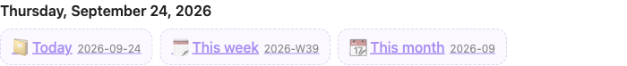
</picture>

Folders and filename formats come from [Periodic
Notes](https://github.com/liamcain/obsidian-periodic-notes) when you have it, and from the
core **Daily notes** plugin for the day. Anything you set in Dashy's own settings wins over
both. A note that does not exist yet still gets a link, drawn dimmed. Clicking it creates
the note.

### `tiles`: navigation

A grid of links into the vault, with a live count of what is in each folder.

````markdown
```tiles
columns: 4
items:
  - { label: Inbox, path: Inbox, icon: 📥, badge: count }
  - { label: Diary, path: Diary, icon: 📔, badge: count, sub: one note a day }
  - { label: Books, path: Books, icon: 📚, badge: count }
  - { label: Sport, path: Diary, icon: 🏃, accent: true, sub: training log }
```
````

<picture>
  <source media="(prefers-color-scheme: dark)" srcset="docs/screens/tiles-dark.png">
  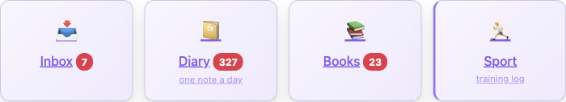
</picture>

`path` also understands a Bases view (`path: Vault.base#My view`), which is the answer
whenever you want a table.

### `stats`: the numbers

One card per number, counted over whatever selection you describe.

````markdown
```stats
columns: 4
items:
  - { label: Days logged, source: Diary, agg: count, icon: 📔 }
  - { label: Average sleep, source: Diary, field: sleep_score, agg: avg, precision: 1, trend: 30d }
  - { label: Steps this week, source: Diary, field: steps, agg: sum, unit: steps, period: week }
  - { label: Longest streak, source: Diary, field: sleep_score, agg: streak, unit: days }
```
````

<picture>
  <source media="(prefers-color-scheme: dark)" srcset="docs/screens/stats-dark.png">
  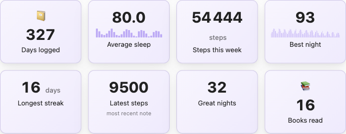
</picture>

`agg` is one of `count`, `sum`, `avg`, `min`, `max`, `latest`, `streak`. Add `trend: 30d`
and the card sketches the last thirty days beside the number, scaled between its own
smallest and largest value. Sleep scores of 70 to 80 plotted from zero are a flat line that
says nothing. A day with no note is left out rather than drawn as a zero, two notes landing
on the same day are summed into that one day's bar, and a diary that stopped months ago draws
nothing at all, which is the honest answer.

When there is nothing to count the card shows a dash. "No notes at all" and "the sum is
zero" are different answers, and a zero for the first would be a lie.

Add `period: week`, `month` or `year` and the card counts only the current calendar one,
ending today; a rolling count of days works too, `period: 30d`. A note's date is its name, as
long as it starts with `YYYY-MM-DD` (`2026-03-02 Monday` and `2026-03-02_standup` both count,
`2026-03-021` does not), unless `date_field` names a frontmatter date property instead, in
which case the name is not consulted at all. `streak`, `latest` and `trend` resolve a note's
date the same way, `date_field` included, whether or not `period` is even set, and two or
more notes landing on the same day always count as that one day, not two. Notes without a
date are left out before counting, so an empty week is not an error: `agg: count` reads the
honest `0`, and a field aggregate like `sum` shows a dash by its usual rule above. Only a
selection where not one note has a date at all is worth a warning, "no note fell in this
window" and "nobody here has a date" being different problems. `trend` keeps its own trailing
window regardless of `period`.

Add `compare: true` next to `period` and the card also shows the delta against the same
stretch of the previous period, to date: a Thursday this week compares against Monday to
Thursday last week, not the whole of last week. `better: up` colours a rise green and a fall
red; `better: down` reverses that for a number where less is better, and with neither set the
delta stays a neutral colour. When either window has no notes in it at all, the card shows
its number alone rather than a made-up delta; `streak` cannot be compared this way and
refuses `compare` outright, the same way `trend` refuses `count`.

### `progress`: how far along

````markdown
```progress
items:
  - { label: Days logged this year, source: Diary, agg: count, goal: 365, icon: 📔 }
  - { label: Books this year, source: Books, period: year, date_field: finished, agg: count, goal: 24, icon: 📚 }
  - { label: Steps, source: Diary, field: steps, agg: sum, goal: 3000000, unit: steps }
```
````

<picture>
  <source media="(prefers-color-scheme: dark)" srcset="docs/screens/progress-dark.png">
  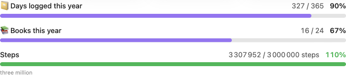
</picture>

Beating a goal shows as it is. 110% stays 110%, and only the bar stops at full.

`period` and `date_field` work the same way they do on `stats`, narrowing what the goal is
measured against rather than the whole selection, and feeding `streak` and `latest` too.
"Books this year" above reads a `finished` property on each book instead of the note name,
since a book is rarely named as a date.

### `countdown`: what is coming

````markdown
```countdown
columns: 3
items:
  - { label: IRONMAN 70.3, date: 2027-06-14, icon: 🏊 }
  - { label: Holiday, date: 2027-01-20, icon: 🏖, sub: two weeks off }
  - { label: Review, date: 2027-03-01, icon: 🗒 }
```
````

<picture>
  <source media="(prefers-color-scheme: dark)" srcset="docs/screens/countdown-dark.png">
  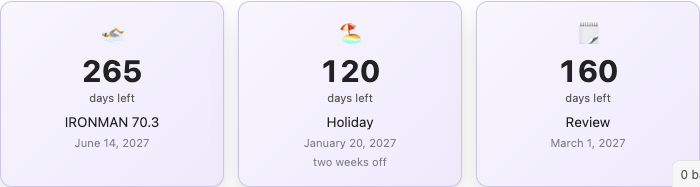
</picture>

A date that has passed keeps its card and counts up instead of down.

### `heatmap`: the year

A cell per day, coloured by a number from frontmatter.

````markdown
```heatmap
source: Diary
field: sleep_score
color: purple
bands: [90, 80, 70]
title: Sleep, last twelve months
```
````

<picture>
  <source media="(prefers-color-scheme: dark)" srcset="docs/screens/heatmap-dark.png">
  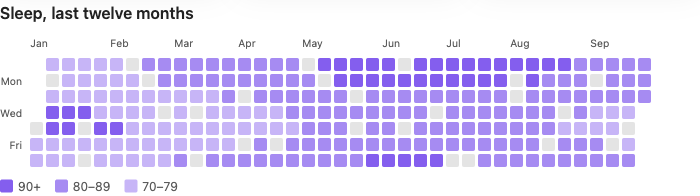
</picture>

A note's date is its name, as long as it starts with `YYYY-MM-DD` (`2026-01-05 Monday` counts,
`2026-01-051` does not), unless `date_field` names a frontmatter date property instead. That is
how the block knows which cell it belongs to. Two or more notes landing on the same day paint
one cell: their values sum, and a ticked or numeric note always outweighs a `false` one on the
same day. A sum suits steps or pages split across two notes; a mood rated 7 and then 8 reads as
15, so keep a score like that in one note a day. Clicking a cell opens that day's note; with more than one contributing, it opens the
first by path. The week starts where your language starts it: Monday here, Sunday in the US,
Canada and Japan.

`field` can also be a checkbox property: a ticked day counts as 1 and paints its cell.
That is the whole of [the habit tracker](#a-habit-tracker-from-daily-note-checkboxes).

## It keeps up with the vault

Add a note, edit a number, delete something, and every block on the page redraws. No
reopening, no command to run.

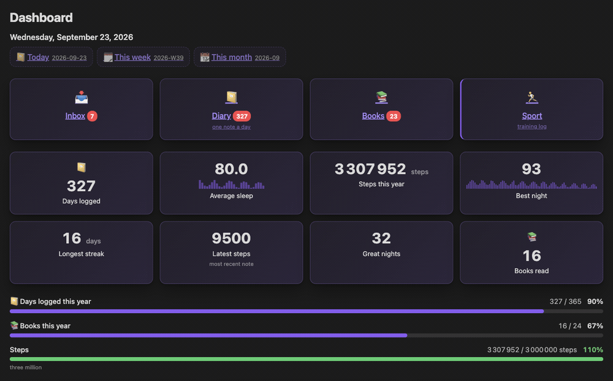

Obsidian lists your files well before it has read their frontmatter. Without this, a
dashboard opened right after startup would show the numbers of a half-read vault and never
correct them.

## It keeps up with your theme

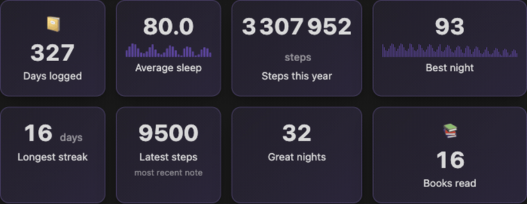

## When the config is wrong

A block that cannot draw tells you why, in the note, next to the thing that failed.

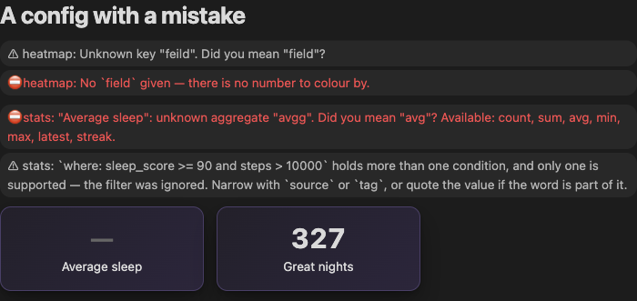

Unknown keys suggest the key you probably meant. A broken YAML line reports its line
number. A filter that could not be read says that the numbers below it are unfiltered,
instead of showing you the wrong ones as if they were right.

## Your AI agent can write these blocks

Two buttons in the settings, and both write only when you press them.

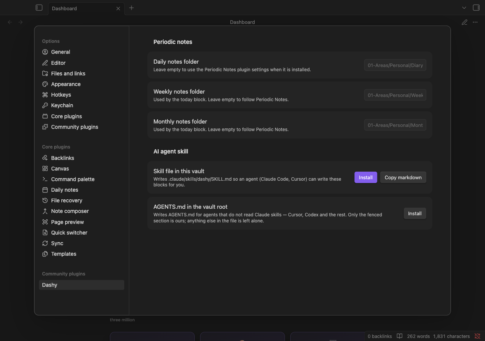

- **Skill file in this vault** writes `.claude/skills/dashy/SKILL.md`, which Claude Code
  reads on its own.
- **AGENTS.md in the vault root** writes the same reference where Cursor, Codex and the
  rest look for it. Only the fenced section belongs to Dashy. Anything else in that file
  stays as it was.

After that you can just ask:

> Make me a dashboard for my training log: a heatmap of distance, cards for weekly volume
> and longest run, and a countdown to the marathon in May.

Both files come from [`src/blocks/schema.json`](src/blocks/schema.json), the same file the
plugin validates against, so the reference an agent reads cannot drift from what the code
accepts. You can read it yourself in [`docs/SKILL.preview.md`](docs/SKILL.preview.md).

## If something is wrong, or missing

The settings tab has a row for each: a bug report and a feature request both open GitHub
with your plugin and Obsidian versions already filled in, so nobody has to ask for them.

The blocks are deliberately few. `where` takes one condition, there is no chart block, and
the list stops at six. Those are decisions rather than omissions, and the fastest way to
change one is to say what you tried to build and could not.

## Languages

The plugin speaks the language of your Obsidian interface. English, Russian, German,
French and Spanish ship today. Settings has a dropdown if you want another one: a vault
whose notes are German does not have to run Obsidian in German to get a German dashboard.
Anything missing from a translation falls back to English rather than showing you a key.

The German, French and Spanish catalogues were written by the author, who speaks none of
the three well enough to be sure of them. Corrections are welcome and cheap: copy
[`src/i18n/en.ts`](src/i18n/en.ts), translate the values, register the file. No TypeScript
needed, and a partial translation is a valid one. Dates, month names and the first day of
the week come from Obsidian itself, so they are right in every language it supports.

## Development

```bash
npm install
npm test           # vitest, with coverage gates
npm run lint       # eslint + eslint-plugin-obsidianmd
npm run typecheck
npm run build      # main.js + styles.css
```

| | |
|---|---|
| `npm run preview` | every block in every state, in a browser, with theme and language switches |
| `npm run e2e` | the suite against a real Obsidian |
| `npm run capture` | regenerates the pictures in this README |
| `npm run build:skill` | rebuilds the agent reference from the schema |
| `npm run scorecard:check` | mirrors the community-plugin review scanner |

`VAULT_PLUGIN="/path/to/vault/.obsidian/plugins/dashsidian" npm run dev:vault` builds
straight into a test vault and watches for changes.

Logic lives in `src/core/`, which imports neither Obsidian nor the DOM and is tested
without mocks. `src/blocks/` only draws. The design notes are in
[`docs/SPEC.md`](docs/SPEC.md).

## License

[MIT](LICENSE) © Dmitriy Yurkin
