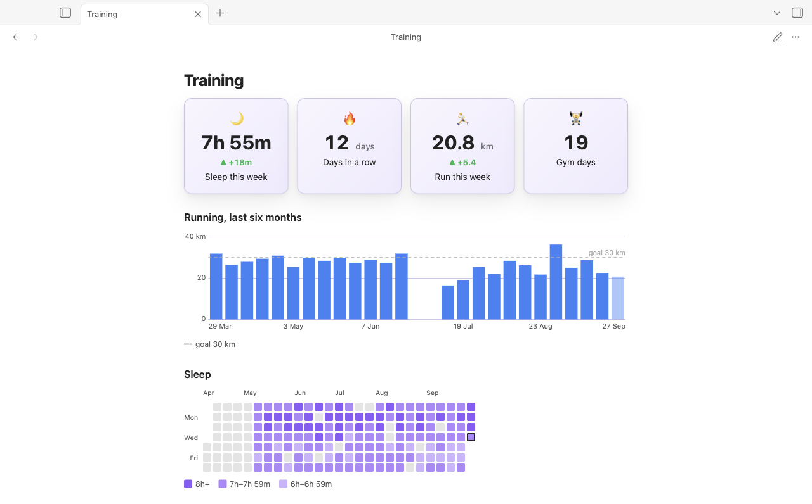
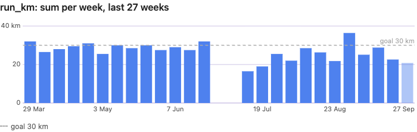
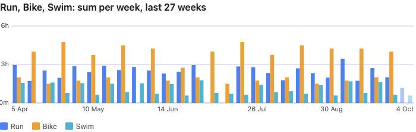
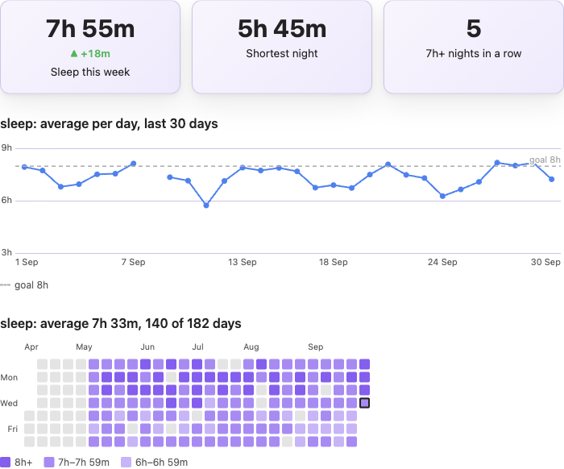
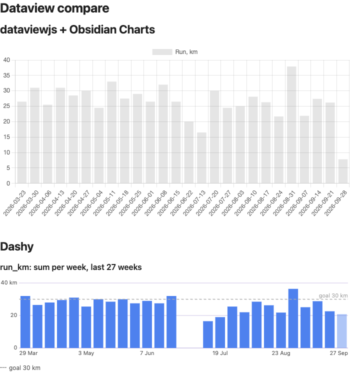

# Dashy

<picture>
  <source media="(prefers-color-scheme: dark)" srcset="https://raw.githubusercontent.com/Dimagious/dashsidian/HEAD/docs/banner-dark.svg">
  
</picture>

[](https://community.obsidian.md/plugins/dashsidian)
[](https://github.com/Dimagious/dashsidian/releases)
[](https://github.com/Dimagious/dashsidian/stargazers)

[Install](#install) · [Charts](#chart-a-number-over-time) · [Habit tracker](#a-habit-tracker-from-daily-note-checkboxes) · [Blocks](#the-blocks) · [Questions](#questions) · [Website](https://dimagious.github.io/dashsidian/)

**Charts, streaks, heatmaps and goals from the properties in your daily notes.**
Each block is a few lines of YAML. No JavaScript, no Dataview, and it runs on your phone.

<picture>
  <source media="(prefers-color-scheme: dark)" srcset="https://raw.githubusercontent.com/Dimagious/dashsidian/HEAD/docs/screens/hero-dark.png">
  
</picture>

That page is one note and three blocks: `stats`, `chart` and `heatmap`. The chart in the
middle is this, in full:

````markdown
```chart
source: Diary
field: run_km
type: bar
bucket: week
unit: km
goal: 30
title: Running, last six months
```
````

## What you can build

| | Blocks |
|---|---|
| [A habit tracker from daily note checkboxes](#a-habit-tracker-from-daily-note-checkboxes), with [the streak you are on today](#the-streak-you-are-on-right-now) | `stats`, `heatmap` |
| [A sleep log](#sleep-in-hours-and-minutes) that reads `7h 38min` the way your tracker writes it | `stats`, `chart`, `heatmap` |
| [Weekly training volume](#chart-a-number-over-time) against a goal line | `chart` |
| [A reading goal for the year](#progress-how-far-along) | `progress` |
| [A home page](#tiles-navigation) with today's notes and live folder counts | `today`, `tiles` |
| [Countdowns](#countdown-what-is-coming) to a race, a holiday, a review | `countdown` |

## Install

Settings → **Community plugins** → **Browse** → search for **Dashy** → Install → Enable.

Open a note, run **Dashy: Insert block** from the command palette, pick a block. A working
example lands at the cursor, already pointed at a folder and a property from your own vault.

## New in 1.5.0

- **`chart`**: a line or bars over days, weeks or months, up to four series, with a goal line.
- **Durations**: `5h 58min`, `7:30` and `0:51:20` count as numbers, and `7:30` comes back as `7h 30m`.
- **`current_streak`**: the run you are on today, next to the best one on record.
- **`where` takes several conditions**: `where: "year = 2026 and rating >= 4"`.
- **Clearer errors**: a key borrowed from another block names what it is called here.

Full list in the [changelog](CHANGELOG.md).

## `chart`: a number over time

<picture>
  <source media="(prefers-color-scheme: dark)" srcset="https://raw.githubusercontent.com/Dimagious/dashsidian/HEAD/docs/screens/chart-weekly-dark.png">
  
</picture>

````markdown
```chart
source: Diary
field: run_km
type: bar
bucket: week
unit: km
goal: 30
```
````

Your notes already hold one number per day. `bucket: week` adds them up by week, the week
starting where your language starts it. The week you are in is drawn lighter and its tooltip
says "so far". A week with no runs is a gap, never a fake zero.

Two lines, `source` and `field`, are enough for the last 30 days as a line. Put up to four
properties on one chart with `series`:

````markdown
```chart
source: Diary
type: bar
bucket: week
series:
  - { field: run_time, label: Run }
  - { field: bike_time, label: Bike, color: orange }
  - { field: swim_time, label: Swim, color: cyan }
```
````

<picture>
  <source media="(prefers-color-scheme: dark)" srcset="https://raw.githubusercontent.com/Dimagious/dashsidian/HEAD/docs/screens/chart-series-dark.png">
  
</picture>

Hover a bar for its value and the note behind it; click a day to open that note. On a phone,
the first tap shows the value and a second tap opens the note.

<details>
<summary>Every <code>chart</code> key, and how the edges behave</summary>

| Key | What it does |
|---|---|
| `source`, `tag`, `where`, `date_field` | which notes, the same as on every block |
| `field` | one numeric or checkbox property. A list here is an error that points at `series` |
| `series` | up to four `{ field, agg, label, color }` entries instead of `field`. Side by side, never stacked, one y axis. An entry's `field` may be a list that folds several properties into one series |
| `agg` | how a bucket becomes one number: `sum` (default), `avg`, `min`, `max`, `count`. `count` needs no `field` |
| `bucket` | `day` (default), `week`, `month` |
| `range` | `week`, `month`, `year` or a count of days like `90d`. Defaults to 30 days for `day`, 182 for `week`, 365 for `month` |
| `type` | `line` (default) or `bar` |
| `goal` | a dashed line with its value; the y axis always stretches to show it |
| `unit`, `precision` | suffix and decimals for the tooltip, the goal and the top axis label |
| `label`, `color` | for a single series; with `series` each entry carries its own |
| `link` | clicking a day opens its note (default `true`); weeks and months have no single note |
| `title` | your own heading |

- **With [Obsidian Charts](https://github.com/phibr0/obsidian-charts) installed, write ` ```dashy-chart `.**
  Both plugins answer to `chart`, and Obsidian hands a code block language to whichever plugin
  claims it first, so a `chart` block may be drawn by Charts. `dashy-chart` takes the same keys
  and is always Dashy's.
- A bucket's values are every value on every note dated in it. A week's `avg` is the same
  number a `stats` card with `agg: avg, period: week` shows. `sum` of a checkbox counts ticked days.
- A bucket with no data is a gap in the line and has no bar. An unticked checkbox is a real 0,
  and so is `count` over an empty bucket.
- The window's start moves back to the start of its bucket, so the first week is whole. More
  than 400 buckets are cut to the latest 400; a single bucket is drawn with a warning.
- Bars start at zero and hang below it for negative values. A line runs from its own lowest
  value to its highest, with at most three labelled gridlines.
- A week's tooltip names it: "Week of Sun Sep 27, 2026". A month starts on the 1st.
- A field nothing carries, one that holds text, or one found only on undated notes is an error
  that says which. An empty window draws its axes and says so.
- The chart is 160 pixels tall, 120 on a narrow screen. There is no `height` key; a CSS snippet
  changes every chart at once: `body { --dashy-chart-height: 240px; }`
- Not in it, on purpose: pie, radar and scatter charts, stacked bars, running totals, a second
  y axis, smoothing, zoom, axis settings. Steps and sleep on one page are two chart blocks.
  For the rest there is [Obsidian Charts](https://github.com/phibr0/obsidian-charts).

</details>

## A habit tracker from daily note checkboxes

Tick `gym: true` in a daily note's Properties and that note already feeds a habit tracker.
Every block that reads a `field` counts a ticked day as 1 and an unticked one as 0.

<picture>
  <source media="(prefers-color-scheme: dark)" srcset="https://raw.githubusercontent.com/Dimagious/dashsidian/HEAD/docs/screens/habits-dark.png">
  
</picture>

````markdown
```stats
columns: 3
items:
  - { label: Gym days, source: Diary, field: gym, agg: sum }
  - { label: Longest streak, source: Diary, field: gym, agg: streak, unit: days }
  - { label: Gym this week, source: Diary, field: gym, agg: sum, period: week, compare: true, better: up }
```

```heatmap
source: Diary
field: gym
```
````

`period: week` means this week, every week, without an edit. `compare: true` sets it against the
same days of last week and turns green when you went more often.

### The streak you are on right now

<picture>
  <source media="(prefers-color-scheme: dark)" srcset="https://raw.githubusercontent.com/Dimagious/dashsidian/HEAD/docs/screens/streak-dark.png">
  
</picture>

````markdown
```stats
columns: 2
items:
  - { label: Days in a row, source: Diary, field: meditate, agg: current_streak, unit: days, icon: 🔥 }
  - { label: Best streak, source: Diary, field: meditate, agg: streak, unit: days }
```
````

`current_streak` counts back from today. Today never breaks it: a day with no note yet leaves
the run counted up to yesterday, and only a missed yesterday resets it.

Streaks bend to real life. `at_least: 5000` counts a day only once the steps get there.
`days: weekdays` lets Friday and Monday join into one run. `skip_field: vacation` makes a
holiday neither break a streak nor extend it.

<details>
<summary>How a streak is counted, in full</summary>

- `streak` is the longest run on record; `current_streak` is the run going on now, counted back
  from today by the same rules. It counts within the card's selection, so `period: month` stops
  it at the first of the month. Notes dated after today are ignored.
- An unticked checkbox breaks a run the way a day with no note does, and so does a note that
  never mentions the field. A numeric `0` is a value and keeps the run going: "0 steps" logged is
  data, "no note today" is not.
- Two notes on the same day count as one day, never a break.
- `at_least` and `at_most` replace "has a value" with a bound on the day's values, summed if
  several notes landed on it. Both together make a range. If `at_least` ends up above
  `at_most`, no day qualifies and the streak reads `0`. Under `current_streak`, a today that has
  not met the bound yet does not break the run.
- `days: weekdays` removes Saturday and Sunday: they neither break a run nor extend it.
- `skip_field` does the same for any day a note marks with a value other than `false`, blank or
  `0`, like `vacation: true` or `sick: flu`. It combines with `days: weekdays`.
- `streak` and `current_streak` refuse `compare`. Without a `field`, a streak counts days that
  have any dated note.

</details>

## Sleep in hours and minutes

Your watch writes `sleep: 7h 38min`. Dashy reads it as a number and shows it back as `7h 38m`:
averages, goals, deltas, heatmap colours and chart axes.

<picture>
  <source media="(prefers-color-scheme: dark)" srcset="https://raw.githubusercontent.com/Dimagious/dashsidian/HEAD/docs/screens/sleep-dark.png">
  
</picture>

````markdown
```stats
columns: 3
items:
  - { label: Sleep this week, source: Diary, field: sleep, agg: avg, period: week, compare: true, better: up }
  - { label: Shortest night, source: Diary, field: sleep, agg: min, period: month }
  - { label: 7h+ nights in a row, source: Diary, field: sleep, agg: current_streak, at_least: 7h }
```

```chart
source: Diary
field: sleep
agg: avg
goal: 8h
```

```heatmap
source: Diary
field: sleep
color: purple
bands: [8h, 7h, 6h]
range: 182d
```
````

<details>
<summary>Which formats are read, and how they are shown</summary>

Read by `stats`, `progress`, `heatmap` and `chart`, as minutes:

- `H:MM` or `H:MM:SS`: `7:30`, `25:10`, `0:51:20`
- `h`, `m` or `min`, `s` or `sec`, largest first, each at most once, spaces optional:
  `5h 58min`, `1h30m`, `45m`, `90 min`, `1.5h`, `30s`

Not read: a value with anything else in it (`running: "10 km · 51min"` stays text), localized
units (`ч`, `мин`), ISO `PT1H30M`, negative durations. `H:MM` is always a duration, never a time
of day: `bedtime: 23:40` counts as 23 hours 40 minutes.

When every value of the field in the selection is a duration, the result reads as one: `sum`,
`avg`, `min`, `max` and `latest` on a card, a bar's value and goal (`7h 5m / 8h`), a `compare`
delta (`▲ +36m`), a heatmap's tooltips, caption average and legend, and a chart's tooltips,
y axis and goal (the axis and goal once every series holds durations). Hours are left out under
an hour (`45m`), minutes when there are none (`8h`), seconds show only under an hour (`51m 20s`).
There are no days: a week of sleep reads `49h 35m`. `count` and `streak` still count notes and days.

`goal`, `at_least`, `at_most` and `bands` take the same formats. A plain number there means
minutes, so `goal: 480` equals `goal: 8h`. `precision` has no effect on a duration, and a `unit`
is dropped with a warning. A field mixing durations and plain numbers counts both as minutes,
shows a plain number, and warns, naming one note of each kind.

</details>

## From `dataviewjs` to Dashy

Weekly running distance as bars, the way it is often done today with Dataview and Obsidian Charts:

````markdown
```dataviewjs
const weeks = {};
for (const p of dv.pages('"Diary"').where(p => p.run_km && p.file.day)) {
  const key = p.file.day.startOf("week").toFormat("yyyy-MM-dd");
  weeks[key] = (weeks[key] ?? 0) + p.run_km;
}
const labels = Object.keys(weeks).sort().slice(-26);
window.renderChart({
  type: "bar",
  data: { labels, datasets: [{ label: "Run, km", data: labels.map(k => weeks[k]) }] },
}, this.container);
```
````

The same chart in Dashy, with a goal line added:

````markdown
```chart
source: Diary
field: run_km
type: bar
bucket: week
unit: km
goal: 30
```
````

<picture>
  <source media="(prefers-color-scheme: dark)" srcset="https://raw.githubusercontent.com/Dimagious/dashsidian/HEAD/docs/screens/compare-dark.png">
  
</picture>

The script works. The top chart keeps Obsidian Charts' default colours, untouched. It
also needs two plugins, drops the weeks you did not run from the axis, and puts a program in
your notes that you debug in a year's time. Tracker users know the other side: one point per
note, and summing by week is still an
[open request](https://github.com/pyrochlore/obsidian-tracker/issues/518). Dashy does the
grouping, the empty weeks, the running week and the theme colours for you, and tells you in the
note when a key is wrong.

## The blocks

Seven blocks, one job each. Every one reads frontmatter through Obsidian's own metadata cache.
Each block below has a picture, its YAML and, where there is more to say, a folded list of
details. Every key of every block is in
[`docs/SKILL.preview.md`](docs/SKILL.preview.md), the reference the agent skill ships.

### `today`: where the day starts

<picture>
  <source media="(prefers-color-scheme: dark)" srcset="https://raw.githubusercontent.com/Dimagious/dashsidian/HEAD/docs/screens/today-dark.png">
  
</picture>

````markdown
```today
daily: true
weekly: true
monthly: true
```
````

Today's date and links to your periodic notes. A note that does not exist yet gets a dimmed
link; click it and the note is created.

<details>
<summary>Folders, formats and when "today" starts</summary>

Folders and filename formats come from [Periodic Notes](https://github.com/liamcain/obsidian-periodic-notes)
when you have it, and from the core **Daily notes** plugin for the day. Anything you set in
Dashy's own settings wins over both.

**New day starts at** (00:00 to 06:00, midnight by default) decides what "today" means for
every block on the page: `period` and `compare` windows, the heatmap's and chart's current day,
`countdown`, `current_streak`. It changes which day this block points to, not which day a note
falls on; a note's date is still its name or `date_field`. Obsidian's own "Open today's daily
note" keeps creating the calendar date's note at any hour.

</details>

### `tiles`: navigation

<picture>
  <source media="(prefers-color-scheme: dark)" srcset="https://raw.githubusercontent.com/Dimagious/dashsidian/HEAD/docs/screens/tiles-dark.png">
  
</picture>

````markdown
```tiles
columns: 4
items:
  - { label: Inbox, path: Inbox, icon: 📥, badge: count }
  - { label: Diary, path: Diary, icon: 📔, badge: count, sub: one note a day }
  - { label: Books, path: Books, icon: 📚, badge: count }
  - { label: Sport, path: Diary, icon: 🏃, accent: true, sub: training log }
```
````

A grid of links into the vault with a live count on each. `path` also takes a Bases view,
`path: Vault.base#My view`, which is the answer whenever you want a table.

<details>
<summary>Counting a selection, and cover images</summary>

`badge: count` counts everything under `path`. Add `tag`, `where`, `period` and `date_field` to
narrow it, with the same meaning as on `stats`: only this month's mail, only today's events.

````markdown
```tiles
columns: 2
items:
  - { label: Mails, path: Mails, icon: 📥, date_field: start, period: month, badge: count }
  - { label: Events, path: Events, icon: 📅, date_field: start, period: 1d, badge: count }
```
````

Those four keys only mean something next to `badge: count`; elsewhere they warn and are ignored.

`image` puts a cover photo above the icon: a vault path (`Attachments/gym.jpg`), a
`[[wikilink]]`, or an `https://` URL. A plain `http://` URL, another scheme, or a vault path
that does not resolve warns, names the value, and draws the tile without the cover.

</details>

### `stats`: the numbers

<picture>
  <source media="(prefers-color-scheme: dark)" srcset="https://raw.githubusercontent.com/Dimagious/dashsidian/HEAD/docs/screens/stats-dark.png">
  
</picture>

````markdown
```stats
columns: 4
items:
  - { label: Days logged, source: Diary, agg: count, icon: 📔 }
  - { label: Average sleep, source: Diary, field: sleep_score, agg: avg, precision: 1, trend: 30d }
  - { label: Steps this week, source: Diary, field: steps, agg: sum, unit: steps, period: week }
  - { label: Longest streak, source: Diary, field: sleep_score, agg: streak, unit: days }
```
````

One card per number. `agg` is `count`, `sum`, `avg`, `min`, `max`, `latest`, `streak` or
`current_streak`. `trend: 30d` sketches the last thirty days beside the number.

<details>
<summary>Selections, periods, compare and the honest dash</summary>

**Which notes.** `source` is a folder, `tag` a tag, `where` a condition on frontmatter:
`where: "rating >= 4"`, `where: "tags contains books"`. Several conditions must all hold, as a
list, `where: [year = 2026, "rating >= 4"]`, or joined by `and`, `where: "year = 2026 and rating >= 4"`.
`and` counts in any case, as a whole word outside quotes, so `status = "waiting and ready"` stays
one condition. `or` is not supported: it warns and the filter is ignored. One unreadable
condition drops the whole filter with a warning quoting it, and the numbers are drawn unfiltered.

**Nested properties.** `field: health.sleep` reads `sleep` under a `health:` map, and `where`
takes the same dotted paths. A literal key with a dot in it wins first. A list is never indexed.

**A note's date** is its name, as long as it starts with `YYYY-MM-DD` (`2026-03-02 Monday`
counts, `2026-03-021` does not), unless `date_field` names a date property instead.

**`period`**: `week`, `month`, `year` or a rolling `30d`, ending today. The week starts on Monday
or Sunday as your language has it. Notes without a date are left out.

**`compare: true`** next to `period` shows the delta against the same stretch of the previous
period to date: on a Thursday, Monday to Thursday last week. `better: up` colours a rise green,
`better: down` the reverse. With an empty window on either side, the card shows its number alone.

**The honest dash.** With nothing to count, `sum` or `avg` shows a dash, not a zero. `count` over
an empty selection reads `0`. A `field` no selected note carries shows a dash and a warning naming
it. A field that holds text, like `running: "10 km · 51min"`, warns too; count those notes with
`where: "running contains km"` and `agg: count`.

**`trend`** scales between its own lowest and highest value, so sleep scores of 70 to 80 do not
flatten into a line. A day with no note is left out, two notes on one day are summed, and a diary
that stopped months ago draws nothing. `trend` keeps its own window regardless of `period`.

</details>

### `progress`: how far along

<picture>
  <source media="(prefers-color-scheme: dark)" srcset="https://raw.githubusercontent.com/Dimagious/dashsidian/HEAD/docs/screens/progress-dark.png">
  
</picture>

````markdown
```progress
items:
  - { label: Days logged this year, source: Diary, agg: count, goal: 365, icon: 📔 }
  - { label: Books this year, source: Books, period: year, date_field: finished, agg: count, goal: 24, icon: 📚 }
  - { label: Steps, source: Diary, field: steps, agg: sum, goal: 3000000, unit: steps }
```
````

Beating a goal shows as it is: 110% stays 110%, and only the bar stops at full. A goal can be a
duration too: `goal: 8h`.

<details>
<summary>More on <code>progress</code></summary>

Every selection and counting key from `stats` works here the same way: `source`, `tag`, `where`,
`period`, `date_field`, and `at_least`, `at_most`, `days` and `skip_field` on a `streak` or
`current_streak` bar. "Books this year" reads a `finished` property, since a book is rarely named
as a date. `columns: 2` (1 to 4) lays bars out side by side; without it each bar is its own row.

</details>

### `countdown`: what is coming

<picture>
  <source media="(prefers-color-scheme: dark)" srcset="https://raw.githubusercontent.com/Dimagious/dashsidian/HEAD/docs/screens/countdown-dark.png">
  
</picture>

````markdown
```countdown
columns: 3
items:
  - { label: IRONMAN 70.3, date: 2027-06-14, icon: 🏊 }
  - { label: Holiday, date: 2027-01-20, icon: 🏖, sub: two weeks off }
  - { label: Review, date: 2027-03-01, icon: 🗒 }
```
````

A date that has passed keeps its card and counts up instead.

### `heatmap`: the year

<picture>
  <source media="(prefers-color-scheme: dark)" srcset="https://raw.githubusercontent.com/Dimagious/dashsidian/HEAD/docs/screens/heatmap-dark.png">
  
</picture>

````markdown
```heatmap
source: Diary
field: sleep_score
color: purple
bands: [90, 80, 70]
title: Sleep, last twelve months
```
````

A cell per day, coloured by a number or a checkbox. Click a cell to open that day's note. On a
phone, the first tap shows the value under the grid and the second opens the note.

<details>
<summary>Layers, ranges, days off and colour scales</summary>

**Several activities, one grid.** `layers` replaces `field`, one colour each:

````markdown
```heatmap
source: Diary
layers:
  - { field: gym, color: blue }
  - { field: run, color: green, label: Running }
```
````

The first painted layer colours a cell; the tooltip lists every layer with a value that day.

**Two properties, one number.** `field: [mood_am, mood_pm]` with `per_day: avg` shows the day's
average. `per_day` is `sum` (default), `avg` or `max`, and also combines two notes on one day.

**A rolling window.** Without `range`, you get a grid per calendar year that has data. `range: 365d`
draws one grid across 1 January; it also takes `week`, `month`, `year` or `90d`.

**Days off.** `skip_field: vacation` hatches a day marked `vacation: true` (anything but `false`,
blank or `0`), so a holiday does not read as a skipped day.

**Colour scale.** `bands: [90, 80, 70]` sets thresholds from the top down, durations included
(`bands: [8h, 7h, 6h]`). Without `bands`, each grid shades itself between its own lowest and
highest value. A checkbox field, or a grid where every value is equal, paints one flat colour.

**Details.** A numeric `0` paints its cell; an unticked checkbox stays empty. A `field` nothing
carries, or one that holds text, is an error that says which. Today's cell gets a ring. The
tooltip shows the date in your language's format, the value, and the note behind it. The week
starts where your language starts it: Monday here, Sunday in the US, Canada and Japan. Notes dated
in the future are not drawn.

</details>

## Built to be left open

**It keeps up with the vault.** Add a note, edit a number, and every block on the page redraws.
Right after startup Obsidian lists files before it has read their frontmatter; Dashy redraws once
it has, so a half-read vault never sticks. At **New day starts at**, the page moves to the new day
by itself.


**It follows your theme.** No colour is hard-coded. Every surface mixes from your theme's
variables and your accent colour, light or dark.


**It tells you when the config is wrong,** in the note, next to the block: a typo gets "did you
mean", a key borrowed from another block gets its name here (`layers` in a chart points at
`series`), a broken YAML line gets its line number, and a filter it could not read says the
numbers below are unfiltered.


## Your AI agent can write these blocks


Two buttons in the settings, and both write only when you press them:

- **Skill file in this vault** writes `.claude/skills/dashy/SKILL.md`, which Claude Code reads on its own.
- **AGENTS.md in the vault root** writes the same reference where Cursor, Codex and the rest look
  for it. Dashy owns only its fenced section; the rest of the file stays as it was.

Then ask:

> Make me a dashboard for my training log: weekly distance as bars with a 40 km goal, cards for
> this week's volume and my current streak, and a countdown to the marathon in May.

Both files are built from [`src/blocks/schema.json`](src/blocks/schema.json), the file the plugin
validates against, so the agent's reference matches what the code accepts. Read it yourself in
[`docs/SKILL.preview.md`](docs/SKILL.preview.md).

## Questions

<details>
<summary>Do I need Dataview?</summary>

No. Dashy reads frontmatter from Obsidian's own metadata cache. Nothing else to install.

</details>

<details>
<summary>Does it work on a phone?</summary>

Yes. It is not a desktop-only plugin. On a phone, a tap on a heatmap cell or a chart bar shows
its value, and a second tap opens the note. A chart gets shorter on a narrow screen.

</details>

<details>
<summary>What does it not do?</summary>

Pie, radar or scatter charts, stacked bars, a second y axis ([Obsidian Charts](https://github.com/phibr0/obsidian-charts)),
tables and queries (Bases, Dataview), kanban, tasks. It reads frontmatter only, not inline
`key:: value` fields. `where` joins conditions with `and`, not `or`. These are decisions: tell us
what you tried to build and could not, and that is the fastest way to change one.

</details>

<details>
<summary>Does a time zone shift my dates?</summary>

No. A note's date is its name or its `date_field`, text that no time zone changes. "Today" and
every `period` window come from your local calendar day, never from `toISOString()`, which turns
local midnight into the previous day east of UTC. At 23:50 in Tokyo, the dashboard still counts
that day as today.

</details>

<details>
<summary>Does a name like <code>2026-01-05 Monday</code> count as a dated note?</summary>

Yes. A name counts when it starts with `YYYY-MM-DD` and the next character, if any, is not a
digit, so a weekday, an underscore or a parenthetical all match. Other formats need a
`date_field` property.

</details>

<details>
<summary>Do blocks update by themselves?</summary>

Yes. Every block redraws when a note is created, deleted, renamed, or its frontmatter edited, and
once more when the day rolls over at **New day starts at**.

</details>

<details>
<summary>Which languages does it speak?</summary>

English, Russian, German, French and Spanish, following your Obsidian interface, or picked in the
settings: a vault of German notes can get a German dashboard without running Obsidian in German.
Dates, month names and the first day of the week come from the date library Obsidian ships.

The German, French and Spanish catalogues were written by the author, who speaks none of the
three well enough to be sure. Corrections are cheap: copy [`src/i18n/en.ts`](src/i18n/en.ts),
translate the values, register the file. A partial translation is valid; anything missing falls
back to English.

</details>

## Bugs and ideas

The settings tab has a row for each. A bug report or a feature request opens GitHub with your
plugin and Obsidian versions already filled in.

## Development

```bash
npm install
npm test           # vitest, with coverage gates
npm run lint       # eslint + eslint-plugin-obsidianmd
npm run typecheck
npm run build      # main.js + styles.css
```

| | |
|---|---|
| `npm run preview` | every block in every state, in a browser, with theme and language switches |
| `npm run e2e` | the suite against a real Obsidian |
| `npm run capture` | regenerates the pictures in this README |
| `npm run build:skill` | rebuilds the agent reference from the schema |
| `npm run scorecard:check` | mirrors the community-plugin review scanner |

`VAULT_PLUGIN="/path/to/vault/.obsidian/plugins/dashsidian" npm run dev:vault` builds straight
into a test vault and watches for changes. Logic lives in `src/core/`, which imports neither
Obsidian nor the DOM and is tested without mocks; `src/blocks/` only draws. Design notes:
[`docs/SPEC.md`](docs/SPEC.md).

## License

[MIT](LICENSE) © Dmitriy Yurkin
