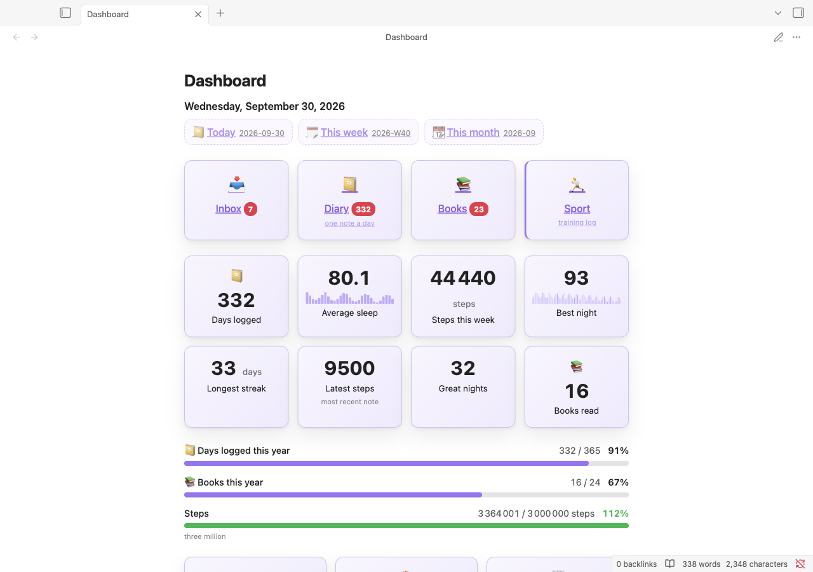
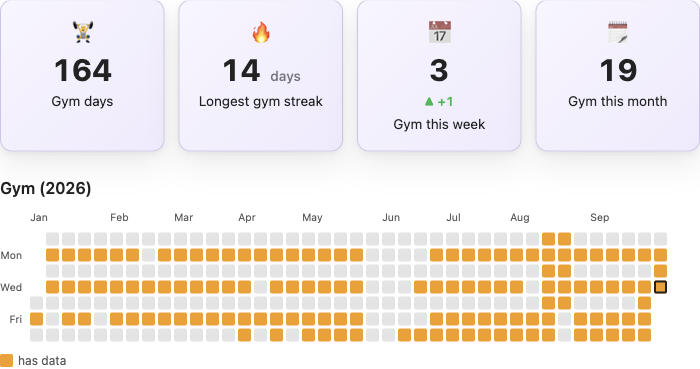
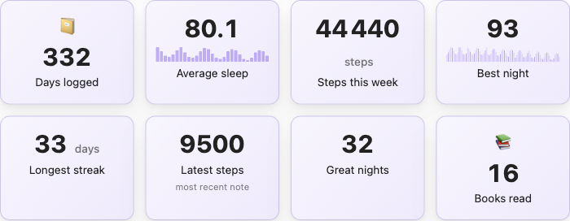
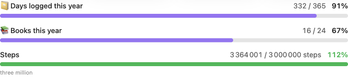
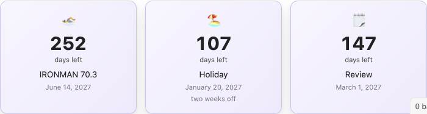
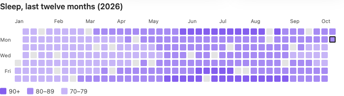
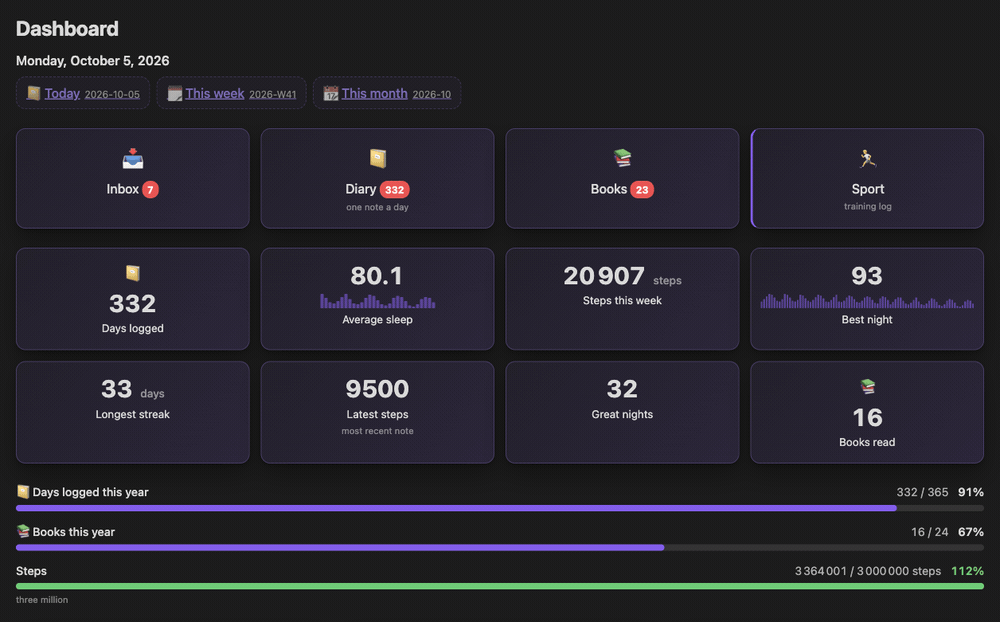
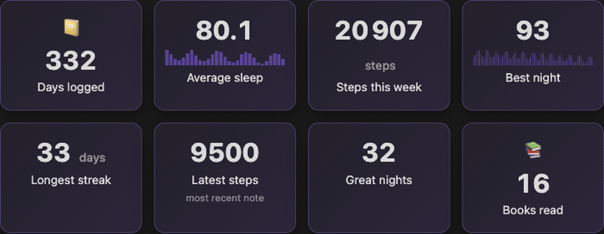
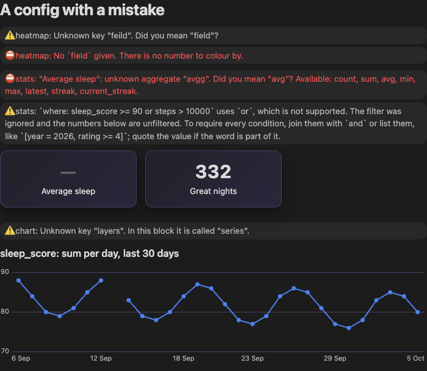
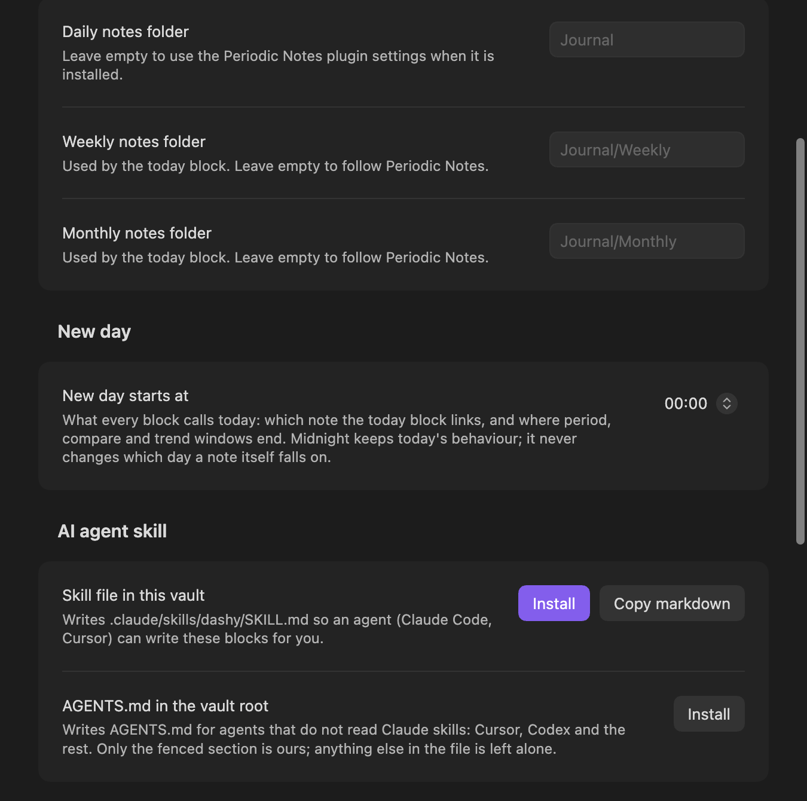

# Dashy

<picture>
  <source media="(prefers-color-scheme: dark)" srcset="https://raw.githubusercontent.com/Dimagious/dashsidian/HEAD/docs/banner-dark.svg">
  
</picture>

[](https://community.obsidian.md/plugins/dashsidian)
[](https://github.com/Dimagious/dashsidian/releases)
[](https://github.com/Dimagious/dashsidian/stargazers)

[Install](#install) · [Habit tracker](#a-habit-tracker-from-daily-note-checkboxes) · [Blocks](#the-blocks) · [Questions](#questions) · [Website](https://dimagious.github.io/dashsidian/)

Build a dashboard inside an Obsidian note from seven markdown blocks. The config is YAML,
a few lines of it. **No JavaScript, and no Dataview.** The same blocks turn the checkboxes
in your daily notes into [a habit tracker](#a-habit-tracker-from-daily-note-checkboxes).

<picture>
  <source media="(prefers-color-scheme: dark)" srcset="https://raw.githubusercontent.com/Dimagious/dashsidian/HEAD/docs/screens/dashboard-dark.png">
  
</picture>

Everything above is one note. Here is the whole of the first block in it:

````markdown
```today
daily: true
weekly: true
monthly: true
```
````

## What it is used for

| What | Blocks |
|---|---|
| [A habit tracker from daily note checkboxes](#a-habit-tracker-from-daily-note-checkboxes) | `stats`, `heatmap` |
| [A reading log, a goal for the year](#progress-how-far-along) | `progress` |
| [A home page with tiles that count a selection, not a whole folder](#tiles-navigation) | `tiles` |
| [Countdowns to a race, a holiday, a review](#countdown-what-is-coming) | `countdown` |
| [Kilometres per week, sleep over the last month](#chart-a-number-over-time) | `chart` |

## A habit tracker from daily note checkboxes

Tick a box in a daily note's Properties, say `gym: true`, and the note already feeds a habit
tracker. Every block that reads a `field` counts a ticked day as 1 and an unticked one as 0.

````markdown
```stats
columns: 3
items:
  - { label: Gym days, source: Diary, field: gym, agg: sum }
  - { label: Longest streak, source: Diary, field: gym, agg: streak, unit: days }
  - { label: Gym this week, source: Diary, field: gym, agg: sum, period: week, compare: true, better: up }
```

```heatmap
source: Diary
field: gym
```
````

<picture>
  <source media="(prefers-color-scheme: dark)" srcset="https://raw.githubusercontent.com/Dimagious/dashsidian/HEAD/docs/screens/habits-dark.png">
  
</picture>

`sum` counts the days you went. `streak` finds your longest run, and an unticked day breaks it
the way a missing note does; `current_streak` counts the run still going today instead.
`period: week` narrows a card to the current week, starting on Monday or Sunday as your
language has it, and `compare: true` sets it against the same days of last week, green when you
went more often. The heatmap paints the ticked days.

You write this once. `period` counts from today, so "this week" is always this week and a
`period: year` card starts over on 1 January without an edit. If you log a day's habit after
midnight, push **New day starts at** in Dashy's settings later: it moves where `period` and
`compare` draw the line, and how far the heatmap's current day reaches, without touching a
single note.

## How it differs from a query plugin

Dashy reads your notes' frontmatter through Obsidian's own metadata cache. Four
consequences of that, worth knowing before you install anything:

- **One plugin, not two.** Nothing to install alongside it, nothing to explain to someone
  you share a vault with.
- **No code in your notes.** A `dataviewjs` block is a program. These are eight lines of
  YAML that you, a month from now, can read at a glance.
- **It follows your theme.** Not one colour is hard-coded. Every surface mixes from the
  variables your theme and accent colour define.
- **It tells you when the config is wrong.** A block that cannot draw says so, in the note,
  with the line number and a guess at what you meant.

What it does not do: pie, radar or scatter charts, or any chart that is not a number over
time (that is [Obsidian Charts](https://github.com/phibr0/obsidian-charts)), tables and
queries (Bases, Dataview), kanban, tasks. Each of the seven blocks has one job.

## Install

Settings → **Community plugins** → **Browse** → search for **Dashy** → Install → Enable.

Then open a note and run **Dashy: Insert block** from the command palette. Pick a block and
a working example lands at the cursor, ready to edit. Everything below is that example.

## The blocks

### `today`: where the day starts

A row with today's date and links to the daily, weekly and monthly notes.

````markdown
```today
daily: true
weekly: true
monthly: true
```
````

<picture>
  <source media="(prefers-color-scheme: dark)" srcset="https://raw.githubusercontent.com/Dimagious/dashsidian/HEAD/docs/screens/today-dark.png">
  
</picture>

Folders and filename formats come from [Periodic
Notes](https://github.com/liamcain/obsidian-periodic-notes) when you have it, and from the
core **Daily notes** plugin for the day. Anything you set in Dashy's own settings wins over
both. A note that does not exist yet still gets a link, drawn dimmed. Clicking it creates
the note.

Dashy's own **New day starts at** setting (00:00 to 06:00, midnight by default) decides what
"today" means here, and for every other block on the page: `period` and `compare` windows,
the heatmap's current day, `countdown`. It changes which day this block points to, not which
day a note itself falls on; a note's own date is still its name or `date_field`. Obsidian's
own "Open today's daily note" command keeps creating the calendar date's note at any hour;
push this setting later and this block keeps linking yesterday's daily note until the chosen
hour comes around.

### `tiles`: navigation

A grid of links into the vault, with a live count of what is in each folder.

````markdown
```tiles
columns: 4
items:
  - { label: Inbox, path: Inbox, icon: 📥, badge: count }
  - { label: Diary, path: Diary, icon: 📔, badge: count, sub: one note a day }
  - { label: Books, path: Books, icon: 📚, badge: count }
  - { label: Sport, path: Diary, icon: 🏃, accent: true, sub: training log }
```
````

<picture>
  <source media="(prefers-color-scheme: dark)" srcset="https://raw.githubusercontent.com/Dimagious/dashsidian/HEAD/docs/screens/tiles-dark.png">
  
</picture>

`path` also understands a Bases view (`path: Vault.base#My view`), which is the answer
whenever you want a table.

`badge: count` normally counts everything under `path`. Add `tag`, `where`, `period` and
`date_field` to narrow it, the same keys and the same meaning as on `stats` below: a mail
inbox where only this month's messages matter, or a calendar folder where only today's
events do, without editing the block when the month turns.

````markdown
```tiles
columns: 2
items:
  - { label: Mails, path: Mails, icon: 📥, date_field: start, period: month, badge: count }
  - { label: Events, path: Events, icon: 📅, date_field: start, period: 1d, badge: count }
```
````

These four keys only mean something next to `badge: count`; on a tile with no badge or a
custom one they are ignored and warn, since there is nothing there for them to narrow.

Add `image` and a tile gets a cover photo above its icon and label: a vault path
(`Attachments/gym.jpg`), a `[[wikilink]]`, or an `https://` URL.

````markdown
```tiles
columns: 2
items:
  - { label: Gym, path: Diary, icon: 🏋, image: Attachments/gym.jpg }
  - { label: Books, path: Books, icon: 📚, image: "[[shelf.jpg]]" }
```
````

A plain `http://` URL and any other scheme are refused, not just quietly skipped: the tile
warns, names the value, and draws without the cover. The same happens for a vault path that
does not resolve to a file, the warning naming both the tile and the path. A tile with no
`image` at all is unaffected either way.

### `stats`: the numbers

One card per number, counted over whatever selection you describe.

````markdown
```stats
columns: 4
items:
  - { label: Days logged, source: Diary, agg: count, icon: 📔 }
  - { label: Average sleep, source: Diary, field: sleep_score, agg: avg, precision: 1, trend: 30d }
  - { label: Steps this week, source: Diary, field: steps, agg: sum, unit: steps, period: week }
  - { label: Longest streak, source: Diary, field: sleep_score, agg: streak, unit: days }
```
````

<picture>
  <source media="(prefers-color-scheme: dark)" srcset="https://raw.githubusercontent.com/Dimagious/dashsidian/HEAD/docs/screens/stats-dark.png">
  
</picture>

`agg` is one of `count`, `sum`, `avg`, `min`, `max`, `latest`, `streak`, `current_streak`. Add
`trend: 30d` and the card sketches the last thirty days beside the number, scaled between its
own smallest and largest value. Sleep scores of 70 to 80 plotted from zero are a flat line that
says nothing. A day with no note is left out rather than drawn as a zero, two notes landing on
the same day are summed into that one day's bar, and a diary that stopped months ago draws
nothing at all, which is the honest answer.

With nothing to count, a field aggregate like `sum` or `avg` shows a dash rather than a
zero: "no notes at all" and "the sum is zero" are different answers, and a zero for the
first would be a lie. `count` has no such gap; an empty selection reads a plain `0`, the
same as everywhere else it counts notes. The dash rule also covers a `field` that no
selected note actually carries: the card shows a dash and a warning naming it, rather than
a plausible-looking zero that hides a typo. A field that holds text instead of a number,
like Garmin's `running: "10 km · 51min"`, warns too; count how many notes have it set with
`where: "field contains ..."` and `agg: count` instead.

`field` reaches into a nested frontmatter property too: `field: health.sleep` reads `sleep`
under a top-level `health:` map. A literal key with a dot in it wins first, since YAML
allows one and some vaults already have `health.sleep: 82` written flat; only when that
exact key is absent does the path get split and walked. A list is never indexed, so
`runs.0` finds nothing. `where` understands the same dotted paths: `where: "health.sleep >= 80"`.

`where` takes several conditions that must all hold, either as a list,
`where: [year = 2026, "rating >= 4"]`, or joined by `and` in one string,
`where: "year = 2026 and rating >= 4"`. `and` is read in any case, and only as a whole word
outside quotes, so `status = "waiting and ready"` stays one condition. `or` is not
supported: it warns and the filter is ignored. The same goes for one condition that
cannot be read among good ones: the whole filter is dropped with a warning quoting it, and
the numbers are drawn unfiltered rather than narrowed by only part of what you asked.

Add `period: week`, `month` or `year` and the card counts only the current calendar one, ending
today; a rolling count of days works too, `period: 30d`. A note's date is its name, as long as
it starts with `YYYY-MM-DD` (`2026-03-02 Monday` and `2026-03-02_standup` both count,
`2026-03-021` does not), unless `date_field` names a frontmatter date property instead, in
which case the name is not consulted at all. `streak`, `current_streak`, `latest` and `trend`
resolve a note's date the same way, `date_field` included, whether or not `period` is even set,
and two or more notes landing on the same day always count as that one day, not two. Notes
without a date are left out before counting, so an empty week is not an error: `agg: count`
reads the honest `0`, and a field aggregate like `sum` shows a dash by its usual rule above.
`streak` (and `current_streak`) with a `field:` follows that same rule, a dash over an empty
window included; without one it counts every selected note's own date instead, and reads a
plain `0` there, the same as `count`. Only a selection where not one note has a date at all is
worth a warning, "no note fell in this window" and "nobody here has a date" being different
problems. `trend` keeps its own trailing window regardless of `period`.

Add `compare: true` next to `period` and the card also shows the delta against the same stretch
of the previous period, to date: a Thursday this week compares against Monday to Thursday last
week, not the whole of last week. `better: up` colours a rise green and a fall red; `better:
down` reverses that for a number where less is better, and with neither set the delta stays a
neutral colour. When either window has no notes in it at all, the card shows its number alone
rather than a made-up delta; `streak` and `current_streak` cannot be compared this way and
refuse `compare` outright, the same way `trend` refuses `count`.

Add `at_least` and/or `at_most` next to `agg: streak` or `agg: current_streak` and a run is no
longer just "has a value": a day counts only once its notes' `field` values, summed for that
day, satisfy the bound, `at_least: 5000` for a steps streak or `at_most: 5` for a
smoke-free-enough one. Both together make a range. Either needs `field:` and is ignored
otherwise, and if `at_least` ends up above `at_most` no day can ever qualify, so the streak
reads a plain `0` rather than refusing to draw. Add `days: weekdays` and Saturday and Sunday
stop counting either way, whatever they hold: they neither break the run nor extend it, so a
Friday followed by a Monday is a run of two, not one.

`skip_field` does the same for a day off you actually took: point it at a checkbox or text
property like `vacation` or `sick`, and a day any note marks with it, `vacation: true` or
`sick: flu`, neither breaks the streak nor extends it, whatever `field` holds that day.
`skip_field: vacation` combines with `days: weekdays`, so a day is transparent when it is a
weekend, a vacation day, or both.

`streak` is the best run on record. `agg: current_streak` is the run going on now, counted back
from today by exactly the same rules: the same filled days, thresholds, `days: weekdays` and
`skip_field`. Today never breaks it: a day with no note yet, or one not meeting the threshold
yet (under `at_least`, or already over `at_most`), leaves the run counted up to yesterday, and
only a missed yesterday or earlier day resets it to `0`. It counts within the card's selection,
so `period: month` stops it at the first of the month. Notes dated after today are ignored.

````markdown
```stats
items:
  - { label: Best streak, source: Diary, field: gym, agg: streak }
  - { label: Days in a row, source: Diary, field: gym, agg: current_streak }
```
````

### `progress`: how far along

````markdown
```progress
items:
  - { label: Days logged this year, source: Diary, agg: count, goal: 365, icon: 📔 }
  - { label: Books this year, source: Books, period: year, date_field: finished, agg: count, goal: 24, icon: 📚 }
  - { label: Steps, source: Diary, field: steps, agg: sum, goal: 3000000, unit: steps }
```
````

<picture>
  <source media="(prefers-color-scheme: dark)" srcset="https://raw.githubusercontent.com/Dimagious/dashsidian/HEAD/docs/screens/progress-dark.png">
  
</picture>

Beating a goal shows as it is. 110% stays 110%, and only the bar stops at full.

`period` and `date_field` work the same way they do on `stats`, narrowing what the goal is
measured against rather than the whole selection, and feeding `streak`, `current_streak` and
`latest` too. "Books this year" above reads a `finished` property on each book instead of the
note name, since a book is rarely named as a date. `at_least`, `at_most`, `days: weekdays` and
`skip_field` work the same way on a `streak` or `current_streak` bar as they do on a stats
card, above.

Without `columns` every bar is its own row, as above; add it to lay bars out side by side
instead, the same key `tiles`, `stats` and `countdown` take, 1 to 4 here.

````markdown
```progress
columns: 2
items:
  - { label: Days logged this year, source: Diary, agg: count, goal: 365, icon: 📔 }
  - { label: Steps, source: Diary, field: steps, agg: sum, goal: 3000000, unit: steps }
```
````

### `countdown`: what is coming

````markdown
```countdown
columns: 3
items:
  - { label: IRONMAN 70.3, date: 2027-06-14, icon: 🏊 }
  - { label: Holiday, date: 2027-01-20, icon: 🏖, sub: two weeks off }
  - { label: Review, date: 2027-03-01, icon: 🗒 }
```
````

<picture>
  <source media="(prefers-color-scheme: dark)" srcset="https://raw.githubusercontent.com/Dimagious/dashsidian/HEAD/docs/screens/countdown-dark.png">
  
</picture>

A date that has passed keeps its card and counts up instead of down.

### `heatmap`: the year

A cell per day, coloured by a number from frontmatter.

````markdown
```heatmap
source: Diary
field: sleep_score
color: purple
bands: [90, 80, 70]
title: Sleep, last twelve months
```
````

<picture>
  <source media="(prefers-color-scheme: dark)" srcset="https://raw.githubusercontent.com/Dimagious/dashsidian/HEAD/docs/screens/heatmap-dark.png">
  
</picture>

A note's date is its name, as long as it starts with `YYYY-MM-DD` (`2026-01-05 Monday` counts,
`2026-01-051` does not), unless `date_field` names a frontmatter date property instead. That is
how the block knows which cell it belongs to. Two or more notes landing on the same day paint
one cell, and a ticked or numeric contributor always outweighs a `false` one on the same day.
`per_day` says how the day's values combine: `sum` (the default) suits steps or pages split
across two notes, `avg` suits a score logged more than once a day, and `max` keeps the best
reading. Clicking a cell opens that day's note; with more than one contributing, it opens the
first by path. A cell's tooltip shows the day in your own language's date format, the value,
and the note behind it: its name when only one contributed, or how many when several did. On a
phone, where there is no hover to read it from, the first tap on a cell shows that same text on
a line under the grid and rings the cell; a second tap on it opens the note, and tapping another
cell moves the line and the ring instead. The week starts where your language starts it: Monday
here, Sunday in the US, Canada and Japan.

`field` can also be a checkbox property: a ticked day counts as 1 and paints its cell.
That is the whole of [the habit tracker](#a-habit-tracker-from-daily-note-checkboxes). A
`field` nothing carries, or one that holds text rather than a number or a checkbox, is an
error that says which, rather than an empty grid that looks like a note-taking gap. A
numeric `0` is still a value and paints its cell like any other; an unticked checkbox
stays empty, and so does a day whose own value is not a number, even when the field is
fine everywhere else. Without `bands`, each grid shades itself by its own minimum and
maximum: a year with a narrow spread and a year with a wide one each get their own scale,
never one stretched to cover both. A checkbox field, or a grid where every painted value
comes out the same, still paints one flat colour instead; set `bands` to pin the scale
yourself. Years come
from the data, newest first, but never one later than today: a note dated in the future
counts nowhere in the grid. Today's own cell gets a ring, on the current year's grid or a
`range` grid, whether or not it has data yet; the ring never changes the cell's own colour
or its hatch, only outlines it.

Logging mood in the morning and evening as two separate properties instead of one note a day?
`field` also takes a list: `field: [mood_am, mood_pm]` with `per_day: avg` collapses both into
one cell showing the day's average, the same as it would across two separate notes. A property
listed twice by mistake is only counted once.

Tracking more than one activity on the same grid, each in its own colour? `layers` replaces
`field` with a list of them, one entry per activity:

````markdown
```heatmap
source: Diary
layers:
  - { field: gym, color: blue }
  - { field: run, color: green, label: Running }
per_day: sum
```
````

A layer without its own `color` gets the next free one from the palette. When a day has more
than one layer painted, the first layer in the list colours the cell and its value is what
`bands` reads; the tooltip still lists every layer that has a value that day, so a gym-and-run
day reads "gym 1, Running 5" rather than hiding the second number. The legend gains a row per
layer, and, with `bands` also set, keeps its usual row too. Averaging different fields together
would not mean anything, so with `layers` the caption drops it and just counts the days some
layer painted.

Vacation or sick, and do not want a gap in the grid to look like a day you simply skipped?
`skip_field: vacation` hatches that day's cell instead: any note landing on it with
`vacation: true` (or any value other than `false`, blank or `0`) gets a diagonal overlay, on
top of its usual colour if it has one, or on its own over an otherwise empty cell. It works
the same way with `layers`, and does not change the caption's count: a special day with
nothing painted is still not one of the "days" the caption counts.

By default the heatmap draws a grid per calendar year that has data, never later than today.
`range: 365d` draws one grid instead, a rolling year that crosses 1 January without splitting
into two:

````markdown
```heatmap
source: Diary
field: sleep_score
color: purple
range: 365d
```
````

`range` takes the same window `stats`' `period` does: `week`, `month`, `year` (1 January of
the current year to today) or a rolling count of days like `90d`. Whichever one it is, a day
outside that window is neither drawn nor counted, and the caption's count and average cover
only the days inside it. Everything else works the same on a range grid: bands, `layers`,
`skip_field` and its legend row, tooltips and links. A window that spans more than one year
names the year on its first month and on every January.

### `chart`: a number over time

A line or bars of one number per day, week or month, in a window ending today.

````markdown
```chart
source: Diary
field: sleep_score
```
````

That is the whole config for a line of the last 30 days, one point a day. `bucket: week` or
`bucket: month` groups the days first, and `agg` says how a bucket's values become its one
number: `sum` (the default), `avg`, `min`, `max`, or `count`, which needs no `field` and counts
the dated notes in the bucket. `type: bar` draws bars instead of a line.

````markdown
```chart
source: Diary
type: bar
bucket: week
unit: km
goal: 40
series:
  - { field: run_km, label: Run }
  - { field: bike_km, label: Bike, color: orange }
  - { field: swim_km, label: Swim, color: cyan }
```
````

`series` puts up to four properties on one chart, each in its own colour: lines side by side,
or bars grouped within their bucket, never stacked, all on one y axis. An entry takes the same
keys a heatmap layer does, `field`, `label` and `color`, plus its own `agg`, and its `field`
may be a list that folds several properties into that one series. A series without a colour
gets the next free one from the palette, and the legend under the chart names each. The
block's own `field` takes a single property: `field: [gym, run]` is an error that points at
`series`, rather than one summed line where you expected two.

A week starts where your language starts it, the same day `period: week` and the heatmap use,
and a week's tooltip names it: "Week of Sun Sep 27, 2026". A month starts on the 1st. `range`
takes the heatmap's window, `week`, `month`, `year` or a count of days like `90d`, and
defaults to 30 days for `day`, 182 for `week` and 365 for `month`. The window's start moves
back to the start of its bucket, so the first week is always a whole one. The last bucket is
usually still running, this week or this month: it is drawn lighter, or as a hollow point on a
line, and its tooltip ends with "so far". More than 400 buckets are cut to the most recent 400,
and a window of a single bucket is drawn but warned about, since one bar has no trend.

A bucket's values are every value the field holds on every note dated in it, so two notes on
one day both count, and a week's `avg` is the same number a `stats` card with `agg: avg,
period: week` shows next to it. `sum` of a checkbox is the number of ticked days. A bucket with
no data is a gap in the line and has no bar: a missing day is not a day of zero. An unticked
checkbox is a real 0, and so is `count` over an empty bucket. A field nothing carries, one that
holds text, or one that only appears on notes without a date is an error that says which; a
window with nothing in it yet draws its axes and says so instead.

Bars always start at zero and hang below it for negative values; a line runs from its data's
own lowest value to its highest, rounded out to at most three labelled gridlines. `goal` draws
a dashed line with its value, and the y axis always stretches to show it. `unit` goes after the
value in a tooltip, on the goal and on the top axis label only, and `precision` sets the
decimals of all three. Hover a
bucket for its date, its value and the note behind it; clicking a day opens that note (the first
by path when there are several), while a week or a month has no single note to open. On a phone
the first tap writes the tooltip under the chart and a second tap on a day opens it.

There is no `height` key. The chart is 160 pixels tall, 120 on a narrow screen, and a CSS
snippet can change that for every chart at once:

```css
body { --dashy-chart-height: 240px; }
```

The chart stops at a number over time. Pie, radar and scatter charts, stacked bars, running
totals, a second y axis, smoothing, zoom and axis settings are not in it, on purpose: steps and
sleep on one chart are two chart blocks.

### Durations: `sleep: 5h 58min`

A sleep tracker or a watch export often writes a length of time as text. `stats`, `progress`,
`heatmap` and `chart` read these as numbers of minutes:

- `H:MM` or `H:MM:SS`: `7:30`, `25:10`, `0:51:20`
- hours, minutes and seconds with `h`, `m` or `min`, `s` or `sec`, largest first and each
  at most once, spaces optional: `5h 58min`, `1h30m`, `45m`, `90 min`, `1.5h`, `30s`

The whole value has to be the duration, so `running: "10 km · 51min"` is still text.
Localized units (`ч`, `мин`), ISO `PT1H30M` and negative durations are not read. `H:MM` is
always a duration, never a time of day: `bedtime: 23:40` counts as 23 hours 40 minutes.

When every value a field holds across the selection is a duration, the result reads as one:
`sum`, `avg`, `min`, `max` and `latest` on a card, the value and the goal on a bar
(`7h 5m / 8h`), a `compare` delta (`▲ +36m`), a heatmap's tooltips, caption average and
legend, and a chart's tooltips, y axis and goal (the axis and the goal only once every series
on it holds durations). Hours are left out under an hour (`45m`), minutes when there are none (`8h`), and
seconds show only under an hour (`51m 20s`); there are no days, so a week of sleep reads
`49h 35m`. `count`, `streak` and `current_streak` still count notes and days. `precision` has no effect on a
duration, and a `unit` is dropped with a warning, since the value already carries its units.

````markdown
```progress
items:
  - { label: Sleep this week, source: Diary, field: sleep, agg: avg, period: week, goal: 8h }
```
````

`goal` (on a bar or a chart), `at_least`, `at_most` and heatmap `bands` take the same formats: `goal: 8h`,
`at_least: 7h`, `bands: [8h, 7h, 6h]` or `{min: 7h}`. A plain number there means minutes, so
`goal: 480` is the same goal. A duration written against a field of plain numbers still
counts as minutes, with a warning that the field is not a duration, and so does a duration
`goal` on `count`, `streak` or `current_streak`, which count notes and days. A field where some notes
hold a duration and others a plain number counts both as minutes, shows a plain number, and
warns naming one note of each kind; `count`, and a streak without a threshold, skip that
warning, since the mix changes nothing they show.

## It keeps up with the vault

Add a note, edit a number, delete something, and every block on the page redraws. No
reopening, no command to run.



Obsidian lists your files well before it has read their frontmatter. Without this, a
dashboard opened right after startup would show the numbers of a half-read vault and never
correct them.

## It keeps up with your theme



## When the config is wrong

A block that cannot draw tells you why, in the note, next to the thing that failed.



Unknown keys suggest the key you probably meant, and a key borrowed from another block says
what it is called here: `layers` in a chart points at `series`. A broken YAML line reports its line
number. A filter that could not be read says that the numbers below it are unfiltered,
instead of showing you the wrong ones as if they were right.

## Your AI agent can write these blocks

Two buttons in the settings, and both write only when you press them.



- **Skill file in this vault** writes `.claude/skills/dashy/SKILL.md`, which Claude Code
  reads on its own.
- **AGENTS.md in the vault root** writes the same reference where Cursor, Codex and the
  rest look for it. Only the fenced section belongs to Dashy. Anything else in that file
  stays as it was.

After that you can just ask:

> Make me a dashboard for my training log: a heatmap of distance, cards for weekly volume
> and longest run, and a countdown to the marathon in May.

Both files come from [`src/blocks/schema.json`](src/blocks/schema.json), the same file the
plugin validates against, so the reference an agent reads cannot drift from what the code
accepts. You can read it yourself in [`docs/SKILL.preview.md`](docs/SKILL.preview.md).

## Questions

<details>
<summary>Does a time zone shift my dates?</summary>

No. A note's date is its name or its `date_field`, text that no time zone changes. "Today"
and every `period` window are built from your local calendar day, never from
`toISOString()`, which would turn local midnight into the previous day everywhere east of
UTC. At 23:50 in Tokyo the dashboard still counts that day as today.

</details>

<details>
<summary>Does a name like <code>2026-01-05 Monday</code> count as a dated note?</summary>

Yes. A note's date is its name whenever it starts with `YYYY-MM-DD` and the character right
after it, if there is one, is not a digit, so a weekday, an underscore or a parenthetical
all still match. Only an eleventh digit right after the day, or a day not padded to two
digits, breaks it.

</details>

<details>
<summary>Do I need Dataview installed?</summary>

No. Dashy reads frontmatter straight from Obsidian's own metadata cache. There is nothing
else to install.

</details>

<details>
<summary>Do blocks update by themselves?</summary>

Yes. Every block redraws when the vault changes: a note created, deleted, renamed, or its
frontmatter edited. Dashy also redraws once the effective day rolls over, at **New day
starts at** in the settings, so a dashboard left open past that hour does not keep showing
yesterday's date and yesterday's `period` windows until something else happens to it.

</details>

<details>
<summary>How is a streak counted?</summary>

`streak` is the longest run of consecutive days on record, not the run still going; for that
one use `current_streak`, which counts back from today and lets today go unfilled without
breaking the run (see [`stats`](#stats-the-numbers) above). An
unticked checkbox breaks it the same way a day with no note does, so a 17-day streak from
last spring stays 17 even if this week has yet to start one. A day where the note exists
but never mentions the field breaks it too, for the same reason: there is nothing to say
the day counts. A numeric `0` is different from an unticked checkbox: it is still a value,
so it keeps a streak going, the way "0 steps" logged is data and "no note today" is not.
Two notes for the same day, however they got their date, count as one day, never a break.
`at_least` and `at_most` replace "has a value" with a bound on it: a day counts only once
the day's values, summed if more than one note landed on it, reach `at_least` and/or stay
under `at_most`. `days: weekdays` is a separate, independent setting: it removes Saturday
and Sunday from the picture entirely, so they neither break a run nor extend it, whether or
not a threshold is also set, and it works just as well on a plain fieldless streak.
`skip_field` is a third, independent one: point it at a property like `vacation` or `sick`,
and a day any note marks with anything other than `false`, blank or `0` is removed from the
picture the same way a weekend under `days: weekdays` is, whatever it holds and whether or
not it also has a value. The two combine: a day is skipped when it is a weekend, marked, or
both.

</details>

<details>
<summary>How does the heatmap choose colours without `bands`?</summary>

Each grid shades itself by its own minimum and maximum: the day with the lowest value
gets the lightest fill, the day with the highest gets full strength, and a multi-year
heatmap fits every calendar year separately, so a narrow year and a wide year never end
up on the same scale. Set `bands` (thresholds from the top down, like `[90, 80, 70]`) to
pin the scale yourself instead. Two situations still fall back to one flat colour, the
same as ever: a checkbox field, since a ticked day is always exactly 1 and there is
nothing to shade by, and a grid where every painted value happens to be equal, since
there is no spread to fit a scale to. A numeric `0` counts as a value and is painted like
any other; an unticked checkbox stays empty, and so does a day whose value is not a
number. With `layers` mixing a checkbox and a numeric activity on the same grid, only the
numeric one is fitted; a ticked checkbox day always paints at full strength, never scored
against a scale that was never really about it.

</details>

## If something is wrong, or missing

The settings tab has a row for each: a bug report and a feature request both open GitHub
with your plugin and Obsidian versions already filled in, so nobody has to ask for them.

The blocks are deliberately few. `where` joins conditions with `and` only, the chart draws a
number over time and nothing else, and the list stops at seven. Those are decisions rather than
omissions, and the fastest way to change one is to say what you tried to build and could not.

## Languages

The plugin speaks the language of your Obsidian interface. English, Russian, German,
French and Spanish ship today. Settings has a dropdown if you want another one: a vault
whose notes are German does not have to run Obsidian in German to get a German dashboard.
Anything missing from a translation falls back to English rather than showing you a key.

The German, French and Spanish catalogues were written by the author, who speaks none of
the three well enough to be sure of them. Corrections are welcome and cheap: copy
[`src/i18n/en.ts`](src/i18n/en.ts), translate the values, register the file. No TypeScript
needed, and a partial translation is a valid one. Dates, month names and the first day of
the week come from the date library Obsidian ships, set to the same language as the blocks,
so they are right in every language it supports.

## Development

```bash
npm install
npm test           # vitest, with coverage gates
npm run lint       # eslint + eslint-plugin-obsidianmd
npm run typecheck
npm run build      # main.js + styles.css
```

| | |
|---|---|
| `npm run preview` | every block in every state, in a browser, with theme and language switches |
| `npm run e2e` | the suite against a real Obsidian |
| `npm run capture` | regenerates the pictures in this README |
| `npm run build:skill` | rebuilds the agent reference from the schema |
| `npm run scorecard:check` | mirrors the community-plugin review scanner |

`VAULT_PLUGIN="/path/to/vault/.obsidian/plugins/dashsidian" npm run dev:vault` builds
straight into a test vault and watches for changes.

Logic lives in `src/core/`, which imports neither Obsidian nor the DOM and is tested
without mocks. `src/blocks/` only draws. The design notes are in
[`docs/SPEC.md`](docs/SPEC.md).

## License

[MIT](LICENSE) © Dmitriy Yurkin
